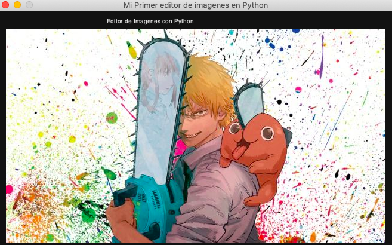
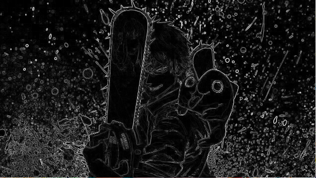
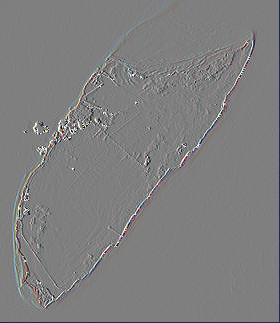

# Mi Primer Editor de Imagenes en Python
Proyecto Universitario de Procesamiento Digital de Imgenes con Python.

# Código del Ejercicio

  - El objetivo principal de la función es crear un editor de imágenes usando Python y la librería PySimpleGUI.

  - Crea un menú con diferentes opciones para la edición de imágenes, como aplicar filtros, operaciones geométricas y guardar/abrir imágenes.

  - Inicializa dos matrices de imágenes vacías para almacenar las imágenes originales y las editadas.

  - Crea una ventana PySimpleGUI con dos marcadores de posición de imagen para mostrar las imágenes originales y editadas.

  - Introduce un bucle while que escucha los eventos del usuario y realiza la correspondiente operación de edición de imagen basada en la selección del usuario.

  - Si el usuario selecciona un archivo de imagen para abrir, lee el archivo de imagen y lo almacena en la matriz de imágenes originales.

  - Si el usuario selecciona guardar la imagen editada, guarda la imagen editada en un archivo.

  - Actualiza los marcadores de posición de imagen con las imágenes originales y editadas después de cada operación de edición.

  - Sale del bucle while y cierra la ventana PySimpleGUI cuando el usuario selecciona salir del programa o cierra la ventana.

####
## Filtro Negativo

- El objetivo principal de la función es convertir una imagen de entrada en su versión negativa.

- La entrada de la función es una imagen, que es una matriz numpy.

- La función crea una copia de la imagen de entrada para evitar modificar la imagen original.

- A continuación, la función determina la anchura y la altura de la imagen.

- A continuación, la función itera a través de cada píxel de la imagen utilizando bucles for anidados.

- Para cada píxel, la función resta los valores rojo, verde y azul de 255 para obtener la versión negativa del píxel.

- A continuación, la función redondea los valores resultantes al número entero más próximo.

- La imagen negativa resultante se devuelve como una matriz numpy.

####
## Filtro Logaritmico

- El objetivo principal de la función es aplicar una transformación logarítmica a una imagen de entrada.

- La entrada de la función es una imagen.

- La función crea primero una copia de la imagen de entrada.

- A continuación, calcula un factor de escala 'u' basado en el valor máximo de píxel de 255 y el logaritmo natural de 256.

- A continuación, la función recorre cada píxel de la imagen y aplica la transformación logarítmica a cada canal de color (rojo, verde y azul) por separado.

- A continuación, se comprueba que los valores de los píxeles transformados se encuentran dentro del intervalo válido de 0 a 255.

- La función devuelve la imagen transformada.

## Filtro Cosenoidal

####

- El objetivo principal de la función es aplicar una función coseno a una imagen de entrada y devolver la imagen modificada.

- La entrada de la función es una imagen, que es un array numpy tridimensional.

- La función primero crea una copia de la imagen de entrada y obtiene las dimensiones de la imagen.

- A continuación, recorre cada píxel de la imagen y aplica la función coseno a cada canal de color (rojo, verde y azul) por separado.

- La función coseno se aplica al valor del píxel multiplicado por 1, y el resultado se eleva al cuadrado y se multiplica por un valor constante de 128.

- Si el valor resultante es menor que 0, se establece en 0. Si es mayor que 255, se establece en 255.

- Los valores de los píxeles modificados se almacenan de nuevo en la copia de la imagen de entrada.

- Finalmente, la imagen modificada se devuelve como salida de la función.

####
## Borde Gradiente

- El objetivo principal de la función es aplicar un efecto de borde degradado a una imagen de entrada.

- La función toma una imagen como entrada.

- Crea una copia de la imagen de entrada y la almacena en una variable temporal.

- A continuación, recorre cada píxel de la imagen, excepto la última fila y columna.

- Para cada píxel, calcula las derivadas horizontales y verticales utilizando los píxeles vecinos.

- A continuación, calcula el valor del color del píxel utilizando la raíz cuadrada de la suma de los cuadrados de las derivadas horizontal y vertical.

- Si el valor de color es superior a 255, lo establece en 255.

- Por último, establece el valor de color del píxel en la imagen temporal y lo devuelve como salida.

####
## Filtro Suavizado

- El objetivo principal de la función es aplicar un filtro de suavizado a una imagen de entrada.

- La entrada de la función es una imagen, que se representa como una matriz numpy.

- La función crea una copia de la imagen de entrada e inicializa algunas variables para almacenar las dimensiones de la imagen y un filtro de suavizado 3x3.

- A continuación, la función recorre todos los píxeles de la imagen, excepto los del borde, y aplica el filtro de suavizado a cada píxel.

- Para cada píxel, la función calcula la media ponderada de los valores de píxel en un vecindario de 3x3 alrededor del píxel, utilizando el filtro de suavizado.

- A continuación, la función actualiza los valores de los píxeles en la copia de la imagen de entrada con los valores suavizados.

- Finalmente, la función devuelve la imagen suavizada como un array numpy.

####
## Reduccion de Ruido

- El objetivo principal de la función es reducir el ruido de una imagen.

- La función toma una imagen como entrada.

- Crea una copia de la imagen de entrada.

- Determina la longitud y la anchura de la imagen.

- Recorre cada píxel de la imagen, excepto los bordes.

- Para cada píxel, crea tres listas vacías para los canales de color rojo, verde y azul.

- Recorre una zona de 3x3 alrededor del píxel y añade los valores de cada canal de color a la lista correspondiente.

- Ordena cada lista en orden ascendente.

- Sustituye el valor del píxel en la copia de la imagen por el valor medio de cada canal de color de las listas ordenadas.

- Devuelve la copia de la imagen con ruido reducido.

####
## Filtro Relieve

- El objetivo principal de la función es aplicar un efecto de relieve a una imagen de entrada.

- La función toma una imagen como entrada.

- Crea una copia de la imagen de entrada y la almacena en una variable temporal.

- A continuación, calcula la longitud y la anchura de la imagen.

- Asigna el valor 127 a la variable q.

- A continuación, recorre cada píxel de la imagen y calcula un nuevo valor de píxel basado en la diferencia entre el píxel actual y el píxel situado a su derecha.

- El nuevo valor del píxel se calcula por separado para cada canal de color (rojo, verde y azul).

- Si el nuevo valor de píxel es mayor que 255, se establece en 255.

- Los nuevos valores de los píxeles se almacenan en la variable temporal de la imagen.

- Finalmente, la variable de imagen temporal se devuelve como salida de la función.

####
## Filtro Reflejo Horizontal

- El objetivo principal de la función es reflejar una imagen horizontalmente.

- La entrada de la función es una imagen.

- La función crea una copia de la imagen de entrada utilizando numpy.

- La función determina la longitud y la anchura de la imagen.

- A continuación, la función itera a través de cada píxel de la imagen utilizando bucles for anidados.

- Para cada píxel, la función sustituye los valores RGB por los valores RGB del píxel que se refleja horizontalmente.

- La función devuelve la imagen reflejada horizontalmente como una matriz numpy.

####
## Filtro Reflejo Vertical

- El objetivo principal de la función es reflejar una imagen verticalmente.

- La función toma una imagen como entrada.

- Crea una copia de la imagen de entrada usando la función copy de numpy.

- Determina la longitud y el ancho de la imagen usando la función len.

- Luego recorre cada píxel de la imagen usando bucles for anidados.

- Para cada píxel, establece el valor del píxel correspondiente en la copia de la imagen al valor del píxel que se refleja verticalmente a través del centro de la imagen.

- Devuelve la imagen reflejada verticalmente como salida.

####
## Escalado de Imagenes

- La función 'escalado' se utiliza para escalar una imagen de entrada por un factor dado.

- La función toma dos entradas: la imagen de entrada y el factor de escalado.

- Crea una copia de la imagen de entrada y calcula la nueva altura y anchura de la imagen escalada.

- Crea una matriz vacía para la imagen escalada y calcula el factor de escala inverso.

- Calcula los índices de píxel de la imagen escalada y utiliza la interpolación bilineal para calcular los valores de píxel de la imagen escalada.

- Devuelve la imagen escalada como salida.

####
## Interrotacion de Imagenes

- El objetivo principal de la función es girar una imagen un ángulo determinado manteniendo la transparencia en el fondo.

- La función toma dos entradas: la imagen que se va a rotar y el ángulo de rotación en grados.

- Convierte el ángulo de grados a radianes y calcula el tamaño de la imagen original.

- A continuación, calcula la matriz de transformación de la rotación utilizando la función de OpenCV cv2.getRotationMatrix2D().

- La función también calcula las nuevas dimensiones de la imagen rotada para garantizar que toda la imagen sea visible después de la rotación.

- Crea una máscara con un fondo transparente utilizando numpy.zeros() y establece los píxeles de la imagen original en blanco.

- La función aplica la matriz de transformación de rotación tanto a la imagen como a la máscara usando cv2.warpAffine().

- A continuación, combina la imagen rotada y la máscara para crear un fondo transparente utilizando cv2.bitwise\_and().

- Por último, la función devuelve la imagen rotada con un fondo transparente.

####

Con filtros: Negativo, Logaritmico, Cosenoidal y Borde Gradiente.

")
")

